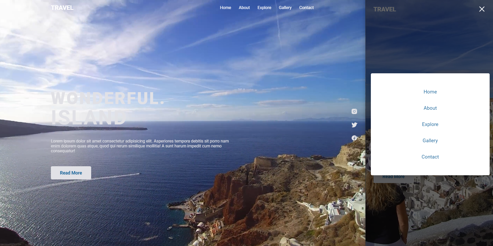

# Travel Image Gallery 📸🚢
Nesse projeto será construida uma aplicação front-end web, para estudo de criação de galeria de imagens, com background em video.



## Tecnologias usadas ⚙
  - React.js
  - Typescript
  - Styled Components
  - Vite
  <!-- - Radix
  - JSON Server
  - React Hook Form
  - Zod
  - Axios -->

## Ultima atualização 🔃
- Slides de video funcionando
- Adicionado efeito no slide de video

## Como utilizar
- Clone o projeto do repositório
```
git clone https://github.com/RafaelMatos/travelimagegallery
```
- Acesse a pasta do projeto
<!-- ```
cd DtMoney
``` -->
- Instale as dependências 
```
npm install
```
<!-- - Execute o JSON Server
```
yarn dev:server
``` -->
- Execute o projeto
```
npm run dev
```

- Acesse no navegador o endereço indicado no terminal

<!--  -->